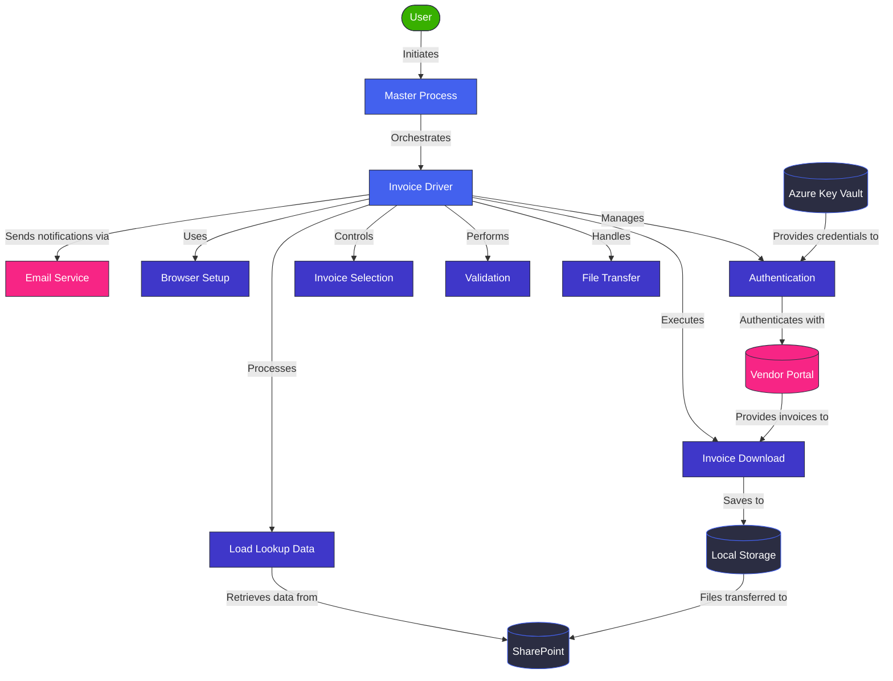
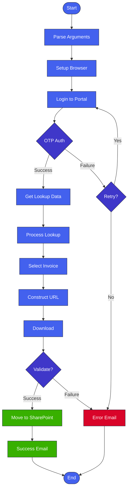
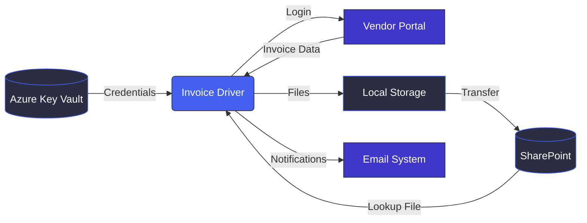
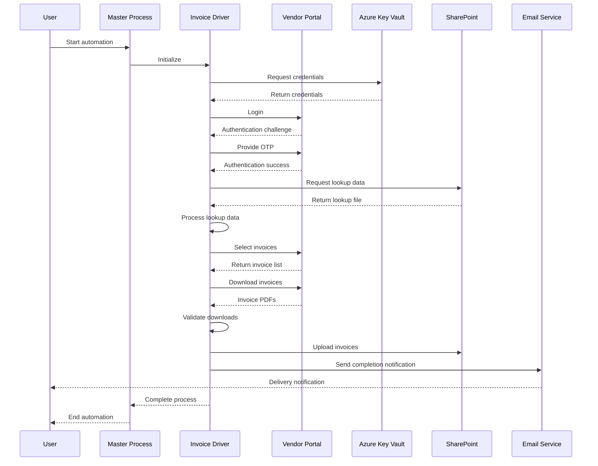

# BlueOcean Invoice Automation System Architecture

## System Overview Diagram



## Process Flow Diagram



## Data Flow Diagram



## Component Interaction Sequence



## Error Handling Flow

```mermaid
flowchart TD
    Error[Error Detected] --> Classify{Classify Error}
    
    Classify -->|Authentication| AuthError[Auth Error]
    Classify -->|Data| DataError[Data Error]
    Classify -->|Download| DownloadError[Download Error]
    Classify -->|Transfer| TransferError[Transfer Error]
    
    AuthError --> AuthRetry{Retry?}
    AuthRetry -->|Yes| RetryAuth[Retry Authentication]
    AuthRetry -->|No| LogAuthError[Log Error]
    
    DataError --> DataRetry{Retry?}
    DataRetry -->|Yes| RetryData[Retry Data Load]
    DataRetry -->|No| LogDataError[Log Error]
    
    DownloadError --> DownloadRetry{Retry?}
    DownloadRetry -->|Yes| RetryDownload[Retry Download]
    DownloadRetry -->|No| LogDownloadError[Log Error]
    
    TransferError --> TransferRetry{Retry?}
    TransferRetry -->|Yes| RetryTransfer[Retry Transfer]
    TransferRetry -->|No| LogTransferError[Log Error]
    
    LogAuthError --> NotifyError[Send Notification]
    LogDataError --> NotifyError
    LogDownloadError --> NotifyError
    LogTransferError --> NotifyError
    
    NotifyError --> End([End With Error])
    
    classDef error fill:#d90429,stroke:#2b2d42,color:white;
    classDef decision fill:#3f37c9,stroke:#2b2d42,color:white;
    classDef action fill:#4361ee,stroke:#2b2d42,color:white;
    classDef end fill:#38b000,stroke:#2b2d42,color:white;
    
    class Error,LogAuthError,LogDataError,LogDownloadError,LogTransferError,NotifyError error;
    class AuthRetry,DataRetry,DownloadRetry,TransferRetry,Classify decision;
    class RetryAuth,RetryData,RetryDownload,RetryTransfer action;
    class End end;
```

## How to Use These Diagrams

1. **View in Markdown Editor**: Open this file in any Markdown editor that supports Mermaid syntax (like VS Code with Mermaid extension).

2. **Export as Images**:
   - Render the diagrams in a Markdown preview
   - Take screenshots or use browser tools to save as images
   - Upload the images to Miro

3. **Use Mermaid Live Editor**:
   - Copy the Mermaid code blocks
   - Paste into [Mermaid Live Editor](https://mermaid.live/)
   - Export as SVG/PNG for high-quality images
   - Import into Miro

4. **Modify as Needed**:
   - Update the diagrams by editing the Mermaid syntax
   - Add new components or connections as your system evolves
